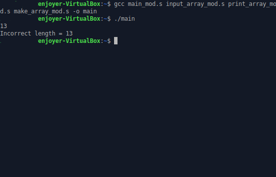

# 4 балла

## Тесты:

###  Тест 1:
  5
  1 2 -4 3 0
  Без модификации:
  
  С модификацией:
  

###  Тест 2:
  5
  1 -3 -6 2 -5
  Без модификации:
  
  С модификацией:
  

###  Тест 3:
  10
  0 3 4 3 2 0 1 4 8 5
  Без модификации:
  
  С модификацией:
  

###  Тест 4:
  5
  917 826 -998 713 602 588
  Без модификации:
  
  С модификацией:
  

###  Тест 5:
  Некорректные данные
  Без модификации:
  
  С модификацией:
  

Как видим, результаты всех прогонов абсолютно идентичны, значит, измение и оптимизация кодаа проведены верно.
